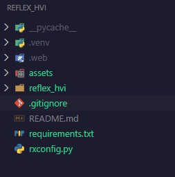

# reflex_hvi

Proyecto para la clinica hospital veterinario integral

# Paso 1 

1. Generar un requirements.txt, incluir reflex dentro de él.
2. Crear un venv "python -m venv .venv"
3. Dentro de el instalar el requirements
4. Una vez instalado, correr reflex init

Seguidos esos pasos, se crearan las carpetas asset, reflex_hvi y rxconfig.py

Añadir el .venv al .gitignore
